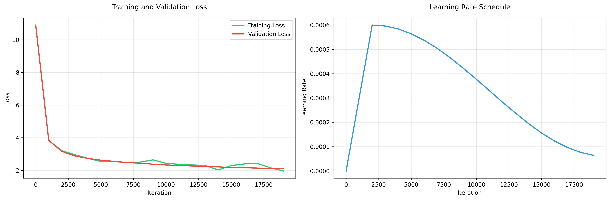

# DeepSeek-Children-Stories 

A state-of-the-art DeepSeek model optimized for children's story generation, featuring advanced architecture with just ~15-18M parameters.

## Architecture Highlights


- **Multihead Latent Attention (MLA)** - DeepSeek's efficient attention mechanism
- **Mixture of Experts (MoE)** - 4 experts with top-2 routing for increased capacity
- **Multi-token Prediction** - Predicts next 2 tokens simultaneously for efficiency
- **Rotary Positional Encodings (RoPE)** - Better position understanding

## Model Specifications

- **Parameters**: ~15-18M (6 layers, 8 heads, 512 embedding dim)
- **Context Window**: 1024 tokens
- **Vocabulary**: GPT-2 compatible (50,257 tokens)
- **Training Data**: 2,000+ children's stories from Hugging Face

## Hardware Used

Training was performed on the following hardware:

- **GPU**: NVIDIA RTX 4090 (24 GB VRAM)
- **RAM**: 41 GB
- **CPU**: 6 vCPU

## Quick Start

### Installation

```bash
# Clone the repository
git clone https://github.com/ideaweaver-ai/DeepSeek-Children-Stories-15M-model.git
cd DeepSeek-Children-Stories-15M-model

# Install dependencies
pip install -r requirements.txt

# Setup the environment
chmod +x setup.sh
./setup.sh
```

### Dataset Preparation

The model is designed to work with datasets that have a specific structure. The current implementation expects a dataset with the following columns:

- **`prompt`**: The story prompt or instruction (e.g., "Write a story about a brave mouse")
- **`text`**: The actual story content to be generated

#### Using the Default Dataset

The model comes pre-configured to use the Hugging Face dataset:
```bash
# Dataset: ajibawa-2023/Children-Stories-Collection
# Contains: 2,000+ children's stories with prompts and text
```

#### Using Your Own Dataset

To use a different dataset, you can modify the configuration in `src/run_training.py`:

1. **Change the dataset name** in the `TrainingConfig` class:
```python
dataset_name: str = "your-dataset-name-here"
```

2. **Ensure your dataset has the required columns**:
   - `prompt`: Story prompts/instructions
   - `text`: Story content
   - Optional: `moral`, `lesson`, `character` (for enhanced structure)

3. **Process your dataset**:
```bash
# The setup script will automatically process your dataset
./setup.sh

# Or manually process the data
python src/data/data_processor.py
```

#### FineWeb Educational Dataset

The model also supports the **HuggingFaceFW/fineweb-edu** dataset for educational content training. This dataset contains high-quality educational web content perfect for training language models on factual, educational material.

**Dataset Structure:**
- `text`: Main educational content (articles, tutorials, educational pages)
- `url`: Source URL of the content
- `date`: Publication date
- `language`: Content language (filtered for English)
- `score`: Quality score (we filter for score > 0.6)

**Key Features:**
- **Size**: ~4TB total (we use optimized sampling)
- **Quality**: High-quality educational content from the web
- **Processing**: Smart filtering by length (100-3000 chars) and quality score
- **Split**: 80% training, 20% validation (optimized for language modeling)

### Complete FineWeb Training Workflow

#### Step 1: Dataset Preparation
```bash
# Activate your environment
source myenv/bin/activate

# Process the FineWeb dataset (downloads ~10GB, processes to ~800MB)
python src/data/fineweb_processor.py
```

**What this does:**
- Downloads 5 parquet files (~10GB total)
- Filters for quality (score > 0.6) and appropriate length
- Processes ~965K examples → ~948K high-quality examples
- Creates 80/20 train/validation split
- Generates binary training files: `fineweb_train.bin` (647MB), `fineweb_validation.bin` (162MB)

#### Step 2: Start Training
```bash
# Basic training with default parameters
python src/run_fineweb_training.py

# Training with custom parameters (recommended)
python src/run_fineweb_training.py \
  --batch-size 8 \
  --max-iters 15000 \
  --learning-rate 6e-4 \
  --eval-interval 500 \
  --n-layer 6 \
  --n-head 8 \
  --n-embd 512
```

#### Step 3: Monitor Training Progress
Training provides real-time monitoring:

**Console Output** (every 500-1000 iterations):
```
iter 1000: train_loss 2.3456, val_loss 2.1234, lr 6.00e-04, time 45.23s
GPU memory: 2.34 GB
```

**CSV Log File** (`fineweb_checkpoints/training_log.csv`):
```csv
iteration,train_loss,val_loss,learning_rate,elapsed_time,gpu_memory_gb
1000,2.345678,2.123456,6.000000e-04,45.23,2.34
2000,2.187654,1.987543,5.950000e-04,89.45,2.34
```

**Monitor in real-time:**
```bash
# Watch the log file
tail -f fineweb_checkpoints/training_log.csv

# Plot progress with Python
python -c "
import pandas as pd
import matplotlib.pyplot as plt
df = pd.read_csv('fineweb_checkpoints/training_log.csv')
plt.plot(df['iteration'], df['train_loss'], label='Train Loss')
plt.plot(df['iteration'], df['val_loss'], label='Val Loss')
plt.legend(); plt.show()
"
```

#### Step 4: Training Outputs
Training automatically saves:
- **Best model**: `fineweb_checkpoints/best_model.pt` (saved when validation loss improves)
- **Regular checkpoints**: Every 2500 iterations
- **Final model**: `fineweb_checkpoints/fineweb_final_model.pt`
- **Training log**: `fineweb_checkpoints/training_log.csv`

#### Step 5: Generate Educational Content
```bash
# Generate educational content
python src/generate.py --model fineweb_checkpoints/best_model.pt \
  --prompt "Machine learning is a subset of artificial intelligence" \
  --max-tokens 200 --temperature 0.7
```

### FineWeb vs Children's Stories

| Feature | Children's Stories | FineWeb Educational |
|---------|-------------------|-------------------|
| **Content Type** | Creative stories | Educational articles |
| **Training Approach** | Prompt → Story generation | Text continuation |
| **Dataset Size** | ~2K examples | ~950K examples |
| **Use Case** | Story generation | Educational content, factual text |
| **Model Output** | Creative narratives | Informative, educational text |

**Processing FineWeb Data (Advanced):**
```bash
# Test the processor with sample data
python src/process_fineweb_sample.py

# Clean up downloaded data if needed
./cleanup_fineweb.sh
```

#### Dataset Structure Example

Your dataset should look like this:
```json
{
  "prompt": "Write a story about a magical forest",
  "text": "Once upon a time, in a magical forest...",
  "moral": "Friendship is the greatest magic",
  "character": "A brave little rabbit"
}
```

### Training

```bash
# Start training
python src/run_training.py

# With custom parameters
python src/run_training.py --batch-size 8 --max-iters 10000 --learning-rate 6e-4
```

### Generation

```bash
# Generate stories
python src/generate.py --prompt "Once upon a time, there was a brave little mouse"

# With custom parameters
python src/generate.py --prompt "A magical forest adventure" --max-tokens 200 --temperature 0.8
```

## 📖 Example Output

Here's an example of a story generated by the model:

**Prompt**: "Once upon a time"

**Generated Story**:
```
it was a bright, sunny day, and lily and her little brother max were playing in their backyard. they found a piece of paper with two sentence written on it. "let's make sense of some of these sentences," said max, pointing to the first sentence. "these people are playing on the grass," "but i don't know," replied lily. she thought for a moment. "maybe they only talk with the others or not, right?" she asked. max nodded. "yeah, and what about 'he', 'he', 'an', 'man', and 'man'?" lily explained, "it means they're playing with their dogs. but they don't say anything about someone talking." max asked, "but what about the others? we don't talk to each other!" lily thought for a moment before answering, "that's right! sometimes, people try to talk to each other. when we talk about something, we need to tell others
```

## Training Metrics

<p align="center">
  
</p>

## Configuration

The model can be configured through command-line arguments:

```bash
# Model configuration
--n-layer 6          # Number of transformer layers
--n-head 8           # Number of attention heads
--n-embd 512         # Embedding dimension
--block-size 1024    # Context window size

# Training configuration
--batch-size 12      # Batch size
--max-iters 20000    # Maximum training iterations
--learning-rate 6e-4 # Learning rate
--eval-interval 1000 # Evaluation interval

# Advanced features
--moe-experts 4      # Number of MoE experts
--multi-token 2      # Multi-token prediction
```

## 🤗 Model Available on Hugging Face

The trained model is now available on Hugging Face Hub! You can use it directly:

**Model**: [lakhera2023/deepseek-children-stories](https://huggingface.co/lakhera2023/deepseek-children-stories)

## Features

### Advanced Architecture
- **MLA**: Efficient attention with shared key-value heads
- **MoE**: Mixture of experts for increased model capacity
- **Multi-token Prediction**: Simultaneous prediction of multiple tokens
- **RoPE**: Rotary positional encodings for better position understanding

### Training Optimizations
- Mixed precision training with gradient scaling
- PyTorch 2.0 compilation for speed
- Automatic checkpointing and model saving
- MoE auxiliary loss for load balancing

### Story Generation
- Creative and engaging children's stories
- Moral lessons and educational content
- Age-appropriate language and themes
- Consistent character development

## Performance

The model achieves:
- Efficient training with ~2.24GB GPU memory usage
- Fast inference for real-time story generation
- High-quality output suitable for children
- Scalable architecture for different use cases


## Contributing

Contributions are welcome! Please feel free to submit a Pull Request.

## License

This project is licensed under the MIT License - see the LICENSE file for details.

## Acknowledgments

- DeepSeek team for the original architecture
- Hugging Face for the children's stories dataset
- PyTorch team for the excellent framework

## Links

- **GitHub**: https://github.com/ideaweaver-ai/DeepSeek-Children-Stories-15M-model

---

⭐ **Star this repository if you think Advanced Architecture + Tiny Models can do Big Things!** 
